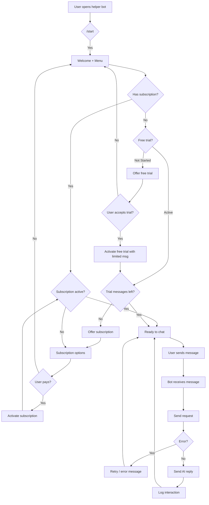
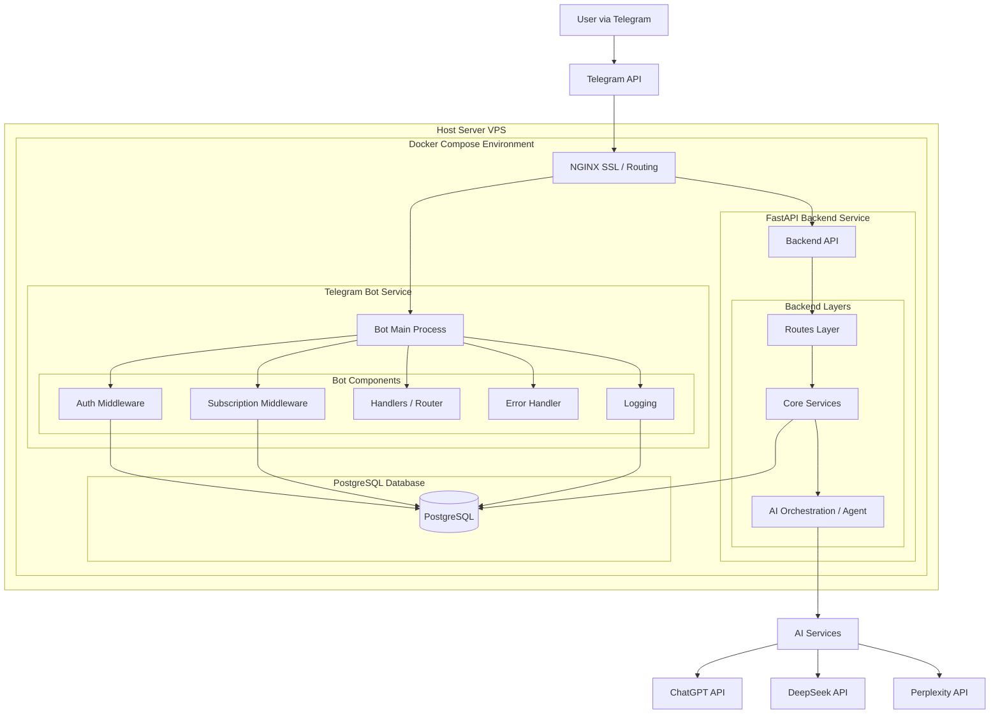
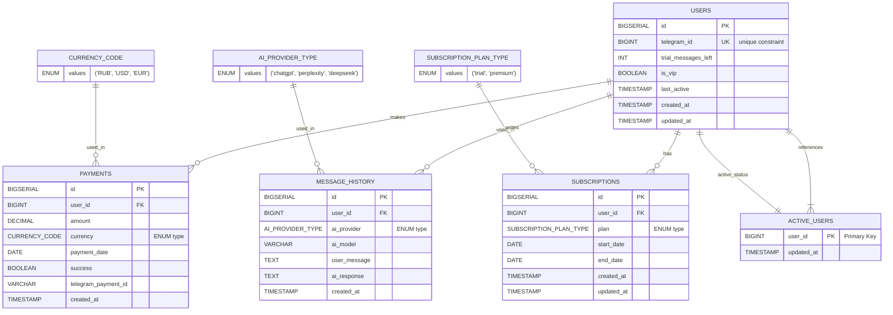

# Помощник-бот (Помогатор)

### 1. Цель  
Создать Telegram-бота, который позволит пользователям взаимодействовать с рядом AI-ассистентов: ChatGPT, Perplexity и DeepSeek.

### 2. Бизнес-логика  

###### 2.1 Пользователь POV

Пользователь будет взаимодействовать с приложением через Telegram-бота.  

Начало работы — с inline-кнопки `/start`. Пользователю будут доступны inline-кнопки, которые позволят:  
- `/start` (начать диалог с ИИ)  
- `/status` (покажет, является ли пользователь VIP или нет)  
- `/help` (стандартное справочное сообщение)  
- `/settings` (можно проверить профиль и информацию о VIP-статусе)  
- `/model` (выбрать между ChatGPT: (Instant, Thinking, GPT-5), Perplexity: (Search, Research, Laboratory) и DeepSeek: (Standard, Thinking))  

В бесплатной версии будет ограниченное количество разрешённых сообщений (10), а в VIP-версии (с ежемесячной подпиской), не будет.  

###### 2.2 Основная бизнес-логика

### 3. Архитектура и стек   

###### 3.1 Arch 

###### 3.2 Stack
Планируется упаковать проект в Docker Compose/Docker.  

**Язык:** Python  
**Телеграм-бот:**
  Aiogram (асинхронность, FSM, промежуточное ПО, инлайн-кнопки).  
**Backend API:**
  FastAPI (REST API для обработки сообщений и бизнес-логики).  
**AI / LLM:** 
  OpenAI, Perplexity, DeepSeek.  
**База данных:**
  PostgreSQL (пользователи, сообщения, кредиты, подписки, платежи).  
**ORM и миграции:**
  SQLAlchemy, Alembic.  
**Платежи:** 
  Telegram Bot Payments API, провайдер платежей в Telegram:
**Инфраструктура:**
  Docker, Docker Compose, NGINX (SSL).  
**Тестирование:**
  Pytest.

### 4. Структура базы данных

###### Структура 

###### 4.2 Предложение шифрования данных в БД

Стоит задуматься о внедрение шифрования чувствительных данных. В качестве первого уровня защиты имеет смысл использовать шифрование диска на сервере и SSL/TLS для всех соединений с PostgreSQL (хотя признаюсь что как это реализовать я пока не полноценно осознал).

 Дополнительно, для таких полей, как telegram_id, сообщения пользователей, ответы ИИ и идентификаторы платежей, можно применять шифрование на уровне базы данных или приложения. Ключи шифрования при этом не хранятся в БД и передаются через переменные окружения или систему секретов (например, Docker Secrets).

### 5. Структура кода

##### 5.1 Cтруктура (на этап 1)

<pre>
helper-bot/
├── docker-compose.yml
├── .env
├── .env.example
├── README.md
├── nginx/
├── bot/
│   ├── app/
│   │   ├── __init__.py
│   │   ├── core.py
│   │   ├── handlers.py
│   │   ├── keyboards.py
│   │   ├── models.py
│   │   └── utils.py
│   ├── .env
│   └── main.py
├── backend/
│   ├── Dockerfile
│   ├── requirements.txt
│   ├── main.py
│   ├── config.py
│   ├── api/
│   │   ├── __init__.py
│   │   ├── dependencies.py
│   │   ├── webhook.py
│   │   ├── process_message.py
│   │   ├── credits.py
│   │   ├── payments.py
│   │   ├── users.py
│   │   └── trial.py
│   ├── services/
│   │   ├── __init__.py
│   │   ├── ai_service.py
│   │   ├── subscription_service.py
│   │   ├── payment_service.py
│   │   └── user_service.py
│   ├── models/
│   │   ├── __init__.py
│   │   ├── database.py
│   │   ├── schemas.py
│   │   └── enums.py
│   ├── database/
│   │   ├── __init__.py
│   │   ├── session.py
│   │   ├── crud.py
│   │   └── migrations/
│   │       ├── versions/
│   │       └── alembic.ini
│   ├── utils/
│   │   ├── __init__.py
│   │   ├── logger.py
│   │   └── exceptions.py
│   └── tests/
│       ├── __init__.py
│       ├── test_api.py
│       ├── test_services.py
│       └── test_database.py
├── images/
├── scripts/
└── .idea/
    ├── inspectionProfiles/
    │   └── profiles_settings.xml
    ├── .gitignore
    ├── helper-bot-imi
    ├── misc.xml
    ├── modules.xml
    └── ves.xml
</pre>

##### 5.2 Cтруктруа (на этап 2)

<pre>
helper-bot/
├── docker-compose.yml        # Оркестрация всех сервисов (бот, бэкенд, база данных, nginx) в виде контейнеров
├── .env.example              # Определение переменных окружения, необходимых всем сервисам
├── README.md                 
├── nginx/                    # Входной обратный прокси-сервер и слой терминации SSL
│   ├── nginx.conf            # Маршрутизация внешнего трафика к сервисам бота и бэкенда
│   └── ssl/                  # TLS-сертификаты для HTTPS / защищённых вебхуков
├── bot/                      # Сервис для взаимодействия с Telegram (уровень представления и взаимодействия)
│   ├── Dockerfile            # Сборка контейнера Telegram-бота
│   ├── requirements.txt      # Зависимости сервиса бота
│   ├── main.py               # Точка входа в приложение и инициализация бота
│   ├── config.py             # Конфигурация бота и загрузка переменных окружения
│   ├── handlers/             # Логика маршрутизации сообщений и взаимодействия с пользователем
│   │   ├── __init__.py
│   │   ├── start.py          # Обработка команд начала работы и онбординга
│   │   ├── chat.py           # Обработка пользовательских сообщений и чат-взаимодействий
│   │   ├── payments.py       # Инициация платёжных потоков и запросов пользователю
│   │   ├── profile.py        # Управление профилем пользователя и просмотром аккаунта
│   │   └── errors.py         # Централизованные ответы на ошибки для пользователя
│   ├── keyboards/            # UI-компоненты для взаимодействия в Telegram
│   │   ├── __init__.py
│   │   ├── main_menu.py      # Основные навигационные меню
│   │   └── payments.py       # Кнопки и меню, связанные с платежами
│   ├── middlewares/          # Скрещивающиеся аспекты, применяемые ко всем сообщениям
│   │   ├── __init__.py
│   │   ├── auth.py           # Проверка идентичности пользователя и валидности сессии
│   │   └── subscription.py   # Проверка ограничений подписки и пробного периода
│   ├── utils/                # Общие утилиты, используемые в сервисе бота
│   │   ├── __init__.py
│   │   ├── logger.py         # Логирование и диагностика для уровня бота
│   │   └── states.py         # Управление состоянием пользователя и определения FSM
│   └── tests/                # Автоматизированные тесты логики бота и промежуточного ПО
│       ├── __init__.py
│       ├── test_handlers.py
│       └── test_middlewares.py
├── backend/                  # Слой основной бизнес-логики и API
│   ├── Dockerfile            # Сборка контейнера сервиса бэкенда
│   ├── requirements.txt      # Зависимости бэкенда
│   ├── main.py               # Точка входа в бэкенд-приложение
│   ├── config.py             # Конфигурация бэкенда и загрузка переменных окружения
│   ├── api/                  # Конечные точки HTTP API, доступные боту и вебхукам
│   │   ├── __init__.py
│   │   ├── dependencies.py   # Общие зависимости API (аутентификация, сессии БД)
│   │   ├── webhook.py        # Обработка входящих вебхуков от Telegram или платёжных провайдеров
│   │   ├── process_message.py # Обработка сообщений, делегированных ботом
│   │   ├── credits.py        # Управление кредитами использования и квотами
│   │   ├── payments.py       # Конечные точки платежей и коллбэки
│   │   ├── users.py          # Конечные точки аккаунта пользователя и профиля
│   │   └── trial.py          # Жизненный цикл бесплатного пробного периода и валидация
│   ├── services/             # Уровень доменной и бизнес-логики
│   │   ├── __init__.py
│   │   ├── ai_service.py     # Оркестрация AI/LLM и логика инференса
│   │   ├── subscription_service.py # Управление состоянием подписки и тарифами
│   │   ├── payment_service.py # Логика интеграции с платёжным провайдером
│   │   └── user_service.py   # Бизнес-правила, связанные с пользователями
│   ├── models/               # Доменные модели и схемы данных
│   │   ├── __init__.py
│   │   ├── database.py       # Движок базы данных и базовые определения моделей
│   │   ├── schemas.py        # Схемы API и валидации
│   │   └── enums.py          # Общие перечисления для согласованности домена
│   ├── database/             # Уровень хранения и доступа к данным
│   │   ├── __init__.py
│   │   ├── session.py        # Управление сессиями и подключениями к базе данных
│   │   ├── crud.py           # Повторно используемые операции доступа к базе данных
│   │   └── migrations/       # Эволюция схемы и управление версиями
│   │       ├── versions/
│   │       └── alembic.ini
│   ├── utils/                # Общие утилиты для бэкенда
│   │   ├── __init__.py
│   │   ├── logger.py         # Логирование и мониторинг бэкенда
│   │   └── exceptions.py     # Централизованные определения ошибок
│   └── tests/                # Тесты компонентов бэкенда
│       ├── __init__.py
│       ├── test_api.py
│       ├── test_services.py
│       └── test_database.py
└── scripts/                  # Инструменты для эксплуатации и обслуживания
    ├── init_db.py            # Инициализация схемы базы данных и начальных данных
    ├── deploy.sh             # Скрипт автоматизации развёртывания
    └── backup.sh             # Скрипт резервного копирования и восстановления базы данных
</pre>

### 6. План разработки и распределение задач

---

###### 6.1 Devs

Dev 1 (Telegram Bot): Создаёт и поддерживает Telegram-бота, обрабатывает команды, инлайн-меню, промежуточное ПО (middleware) и интеграцию с бэкендом. [@Mahmadmurod](https://t.me/Mahmadmurod)

Dev 2 и TL (Backend): Реализует бэкенд на FastAPI, включая API-маршруты, интеграцию AI-сервисов, логику пробного периода и подписок, а также систему логирования. [@local_dan](https://t.me/local_dan)

Dev 3 (База данных): Проектирует, создаёт и управляет базой данных PostgreSQL, миграциями, асинхронными операциями и обеспечивает целостность данных. [@Ufpngh5](https://t.me/Ufpngh5)

Dev 4 (Инфраструктура): Отвечает за развёртывание Docker, настройку Nginx и SSL, централизованное логирование и интеграцию Telegram Payments. [@ne_necoffeee](https://t.me/ne_necoffeee)

---

###### 6.2 Stages 

#### Этап 1 

**Цель:** Запустить работающее ядро: бот принимает сообщение, бэкенд обрабатывает через ИИ, данные сохраняются в БД.

| Порядок | Разработчик | Ответственность | Задачи |
|---------|------------|----------------|--------|
| **1**   | **Dev 3**   | Схема и доступ к данным   | • Настройка PostgreSQL в Docker • Создание базовых таблиц: `users`, `message_history`, `active_users` • Настройка ENUM-типов (`ai_provider_type`) • Конфигурация SQLAlchemy + Alembic • Реализация базового CRUD-слоя                                                        |
| **2**   | **Dev 2**   | Бизнес-логика и API       | • Инициализация FastAPI-проекта • Реализация API-эндпоинтов: `/users/register`, `/trial/start`, `/process_message` • Интеграция AI-провайдеров (ChatGPT, Perplexity, DeepSeek) • Логика пробного периода (лимит сообщений) • Централизованная обработка ошибок и логирование |
| **3**   | **Dev 1**   | Telegram-интерфейс        | • Регистрация бота через BotFather • Команды `/start`, `/help`, базовое меню • Middleware: регистрация пользователя, проверка пробного периода • FSM / состояние пользователя • Отправка сообщений в бэкенд и обработка ответов и ошибок                                     |
| **4**   | **Dev 4**   | Инфраструктура и доставка | • Docker Compose (bot, backend, postgres, nginx) • Настройка Nginx (reverse proxy, SSL) • Переменные окружения и secrets • Базовое централизованное логирование                                                                                  |

---

#### Этап 2 

**Цель:** Добавить монетизацию (Telegram Payments), систему подписок/кредитов.

##### Процесс работы с платежной системой

**Пользователь инициирует оплату.**  
Когда пользователь нажимает кнопку для покупки подписки, бот вызывает API платежного провайдера. Пользователь видит стандартную форму оплаты, предоставляемую платежной системой, и завершает транзакцию.

**Обработка успешного платежа.**  
После завершения оплаты платежный провайдер отправляет уведомление на заранее настроенный адрес нашего сервиса. Мы проверяем подлинность этого уведомления и убеждаемся, что данный платеж еще не был обработан ранее. Затем сохраняем полные детали транзакции в нашу базу данных.

**Активация подписки для пользователя.**  
После подтверждения платежа система обновляет статус пользователя. Создается новая или обновляется существующая запись о подписке с указанием даты начала и окончания. Флаг, определяющий доступ к платным функциям, активируется. Пользователь получает немедленное подтверждение и доступ к сервису.

**Проверка доступа при каждом использовании.**  
Каждый раз, когда пользователь обращается к основному функционалу, система проверяет наличие активной подписки. Для этого выполняется запрос к бд, где хранится текущий статус и срок действия подписки. Доступ предоставляется только при наличии действующей подписки.

**Управление жизненным циклом подписки.**  
Система отслеживает сроки действия всех подписок. Пользователь может получить напоминание перед истечением срока. После окончания подписки доступ к платным функциям автоматически прекращается. Для восстановления доступа необходимо оформить новую подписку.

**Хранение данных.**  
Вся информация о платежах и подписках хранится в нашей собственной базе данных. Мы сохраняем детали транзакций, историю подписок и их связь с пользователями. Эта база является основным источником данных для управления доступом.

**Архитектурный подход.**  
Платежная система используется исключительно как канал для приема средств. Вся бизнес-логика, включая проверки прав доступа и управление сроками подписок, контролируется приложением на основе данных в нашей базе.

---

| Порядок | Разработчик | Ответственность | Задачи |
|---------|------------|----------------|--------|
| **1**   | **Dev 3**   | Схема подписок и платежей              | • Создание таблиц: `subscriptions`, `payments` • Добавление ENUM-типов (`subscription_plan_type`, `currency_code`) • Индексы, внешние ключи и ограничения целостности • Миграции Alembic для платёжной схемы • CRUD-запросы для подписок и платежей                                                  |
| **2**   | **Dev 2**   | Бизнес-логика подписок и платежей      | • Реализация API-эндпоинтов подписок и платежей • Логика жизненного цикла подписки (start / renew / expire) • Валидация платёжных статусов и идемпотентность • Ограничения доступа по подписке (VIP / trial) • Расширенное логирование и обработка ошибок                                            |
| **3**   | **Dev 4**   | Инфраструктура платежей                | • Настройка Telegram Payments (provider token, callbacks) • Конфигурация безопасного проксирования платёжных запросов через Nginx • Управление secrets и переменными окружения для платежей • Централизованный сбор логов (бот / бэкенд / платежи) |
| **4**   | **Dev 1**   | Пользовательский интерфейс монетизации | • UI выбора тарифа и подписки (inline-кнопки) • Инициация платёжного потока Telegram Payments • Обработка статусов платежа (успех / ошибка / отмена) • Отображение VIP-статуса и срока подписки • Сообщения об ограничениях и лимитах                                                                |

---

###### Этап 3

**Цель:** Убедиться в работоспособности всей системы. Надо тоже осущесвить покрытие тестами, (боже найти бы время).

#### Важное примечание:  
Исходный файл README был написан на английском языке и переведён на русский с помощью DeepSeek для экономии времени. Данное примечание добавлено для прозрачности.